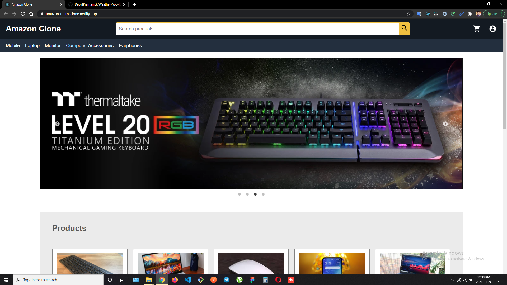
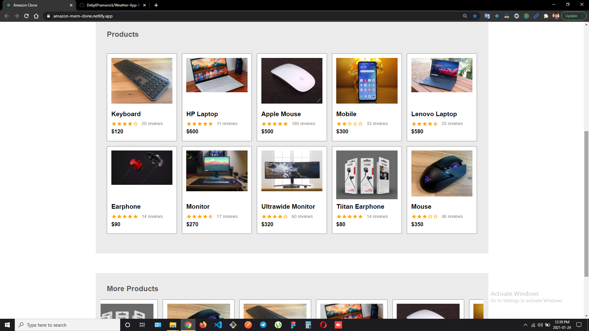
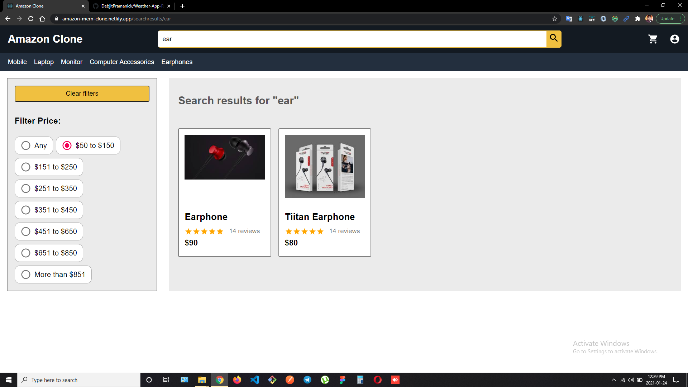
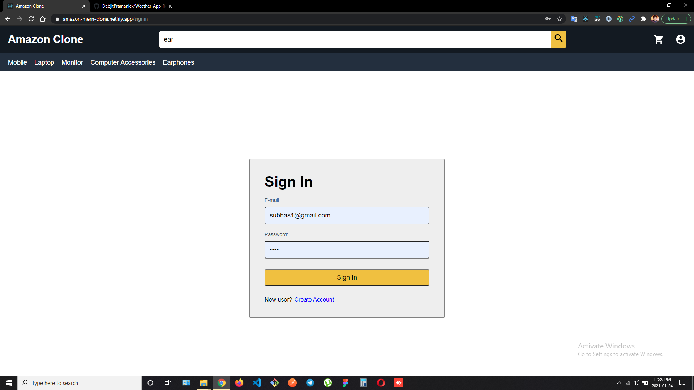
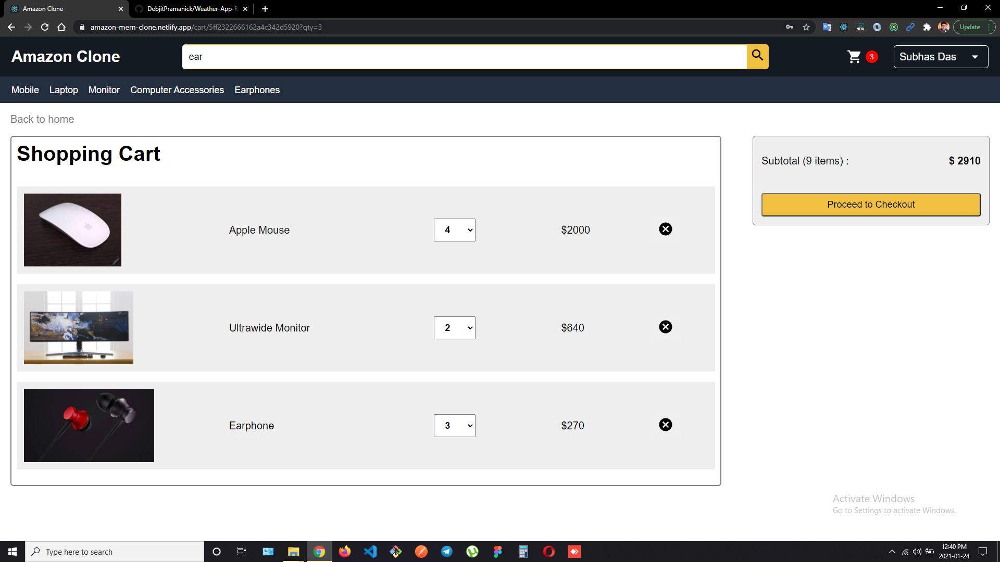
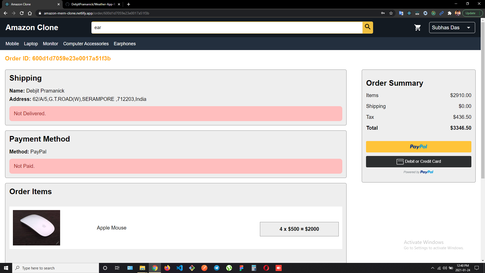

# AMAZON CLONE

Hi! I'm Debjit, a **MERN Stack Developer**. This is a clone of popular e-commmerce website **Amazon**.
I have created it with **React** in frontend,  **Node and Express** for backend and **MongoDB** for storing data.
 
 
> ### Web App Link - https://amazon-clone-eight-rho.vercel.app/

 

## Features

- Register or login as an user.
- Update user account.
- Search products.
- Apply filters for searching products.
- Add products to cart.
- Change the required number for products.
- Payment with PayPal.
- Create order.
- Check order history.

##  NPM Packages Used

- React-redux
- Material UI
- Express
- Nodemon
- Mongoose

## Screenshots

Login Credentials:
1. Email: admin2023@gmail.com
2. Pass: 1234

 

 

 

 

 

